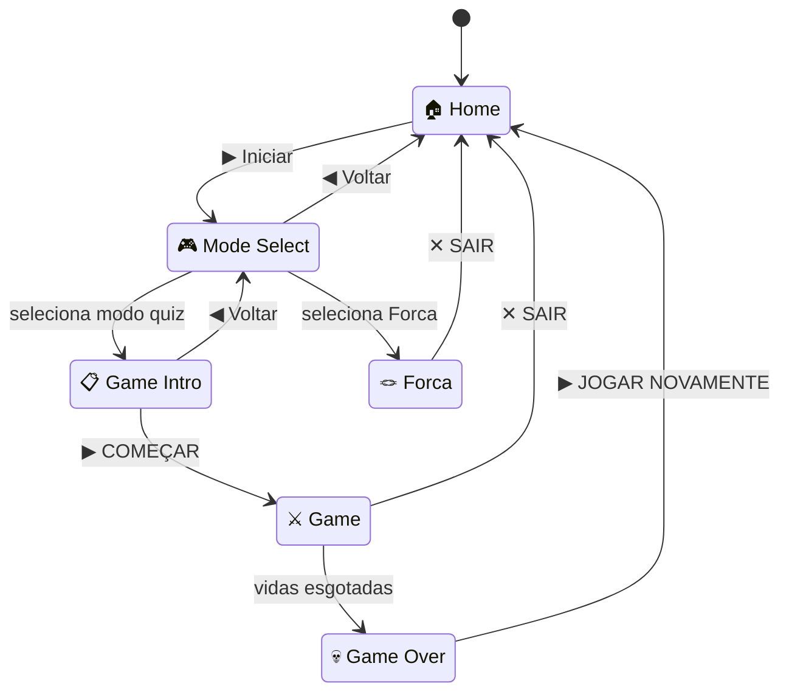

# English Quest

Quiz gamificado de gramática inglesa com estética pixel art inspirada no Super Mario World (SNES), construído com Angular 20 usando Signals e componentes standalone.

## Como rodar

```bash
npm install
npm start
```

Acesse [http://localhost:4200](http://localhost:4200) no navegador.

## O que é o projeto

English Quest é um jogo de perguntas de múltipla escolha de gramática inglesa com mecânicas de progressão:

- **6 modos de jogo** — cinco modos de quiz e um modo de forca (hangman) com banco de palavras próprio
- **Multiplicador de streak** — acertos consecutivos aumentam o XP ganho (1× → 2× → 3× → 5×)
- **Sistema de XP e níveis** — XP acumula e sobe de nível a cada 500 pontos
- **Mensagens de sequência** — NICE! / AWESOME! / INCREDIBLE! / UNSTOPPABLE! / LEGENDARY! / GOD MODE!
- **Ranking de top 5** — salvo via localStorage
- **Explicações após erro** — nos modos que habilitam isso

### Modos de jogo

| Modo | Engine | Vidas | Timer | Explicações | Combo |
|------|--------|-------|-------|-------------|-------|
| Classic | Quiz | 5 | 15s | ✓ | ✓ |
| Speed | Quiz | 5 | 5s | ✗ | ✓ |
| Survival | Quiz | 1 | — | ✗ | ✓ (infinito) |
| Hardcore | Quiz | 1 | 8s | ✗ | ✗ |
| Practice | Quiz | ∞ | — | ✓ | ✗ |
| Forca | Hangman | 6 erros | — | — | — |

## Fluxo de telas



## Estrutura do projeto

```
src/app/
├── app.ts                    # Componente raiz (controla tela: home/mode-select/game-intro/game/gameover/hangman)
├── models/
│   ├── question.model.ts     # Tipos: Question, HighScore, FeedbackState, AppScreen, etc.
│   ├── game-mode.model.ts    # GameModeConfig + GAME_MODES (6 modos; kind: 'quiz'|'hangman')
│   └── hangman.model.ts      # HangmanWord
├── services/
│   ├── game-state.service.ts # Estado do jogo via Signals (score, lives, streak, xp...)
│   ├── quiz.service.ts       # Carrega e embaralha questões do JSON
│   ├── hangman.service.ts    # Estado do Forca via Signals (word, guesses, score, streak...)
│   └── storage.service.ts    # Persistência de high scores no localStorage
└── components/
    ├── home/                 # Tela inicial
    ├── mode-select/          # Seleção de modo de jogo (6 cards coloridos)
    ├── game-intro/           # Tutorial pré-jogo: regras do modo, pontuação, preview de feedback
    ├── game/                 # Loop principal: carrega questão → timer → feedback → próxima
    ├── hud/                  # HUD: score, streak, nível, vidas, timer, XP bar
    ├── question/             # Exibe o texto e metadados da questão
    ├── answers/              # Botões de múltipla escolha
    ├── feedback/             # Feedback pós-resposta: ★ / ✗ / !! + XP ganho
    ├── game-over/            # Tela final: estatísticas + top 5 high scores
    └── hangman/              # Forca: teclado QWERTY, SVG professor pixel-art, tiles de letras
```

## Dados das questões

As questões ficam em [src/assets/data/questions.json](src/assets/data/questions.json). O banco atual tem **100 questões** (39 easy · 38 medium · 18 hard · 5 expert).

As palavras do Forca ficam em [src/assets/data/words.json](src/assets/data/words.json). O banco atual tem **70 palavras** em 7 categorias temáticas (Animals, Food, Nature, Technology, Sports, Adjectives & Concepts, Places & Buildings), cada uma com `id`, `word` (maiúsculas), `category`, `hint` e `difficulty`.

Estrutura de cada questão:

```json
{
  "id": "rp01",
  "type": "multiple_choice",
  "category": "relative_pronouns",
  "topic": "identifying people",
  "difficulty": "easy",
  "question": "The policeman _____ was shot yesterday died today.",
  "options": ["who", "that", "whose"],
  "answer": "who",
  "explanation": "'Who' é usado para pessoas como sujeito da oração relativa.",
  "xp": 10,
  "timeLimit": 15
}
```

Categorias disponíveis: `modal_verbs`, `relative_pronouns`, `question_words`, `past_tense`, `present_perfect`, `conditionals`, `vocabulary`, `phrasal_verbs`.

> **Nota sobre `timeLimit`:** o campo `timeLimit` define o tempo máximo *para aquela questão*, mas o timer efetivo é `Math.min(timeLimit, mode.questionTime)`. Em modos como Speed (5s) ou Hardcore (8s), o tempo do modo prevalece mesmo que a questão tenha `"timeLimit": 15`.

Dificuldade: `easy` (1★), `medium` (2★), `hard` (3★), `expert` (4★).

## Stack técnica

- **Angular 20** — standalone components, Signals, control flow (`@if`, `@for`, `@switch`)
- **SCSS** — tema pixel art SNES Mario com CSS custom properties e pixel-shadow
- **TypeScript 5.8** — strict mode ativado
- **Google Fonts** — Press Start 2P (títulos), VT323 (HUD/corpo)

## Scripts disponíveis

| Comando | O que faz |
|---------|-----------|
| `npm start` | Servidor de dev em `localhost:4200` com hot reload |
| `npm run build` | Build de produção na pasta `dist/` |
| `npm test` | Testes unitários com Karma/Jasmine |
| `npm run watch` | Build em modo watch |

## Requisitos

- Node.js 18+
- npm 9+
